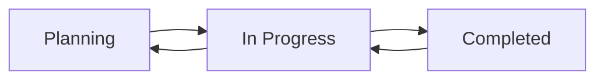

# Demand Planning System - Latinhas LLC

A full-stack web application for managing production demands and planning. This system allows users to create, track, and manage production demands with real-time status updates and comprehensive reporting.

## 🚀 Features

### Frontend
- **Modern UI/UX**: Built with Next.js 14, TypeScript, and Tailwind CSS
- **Responsive Design**: Works seamlessly on desktop and mobile devices
- **Real-time Updates**: Instant form validation and error handling
- **Interactive Tables**: Sortable and searchable demand data
- **Status Tracking**: Visual progress indicators and completion rates
- **Brand Consistency**: Custom color scheme matching Latinhas LLC branding

### Backend
- **RESTful API**: Clean, well-documented API endpoints
- **Data Validation**: Comprehensive input validation and error handling
- **SQLite Database**: Lightweight, file-based database for easy deployment
- **Type Safety**: Full TypeScript support throughout the stack
- **CORS Enabled**: Secure cross-origin resource sharing

### Core Functionality
- ✅ Create, read, update, and delete production demands
- ✅ Track production progress with completion percentages
- ✅ Status management (Planning → In Progress → Completed)
- ✅ Product description and SKU management
- ✅ Date range validation and planning
- ✅ Production vs. planned quantity tracking

## 🛠 Technology Stack

### Frontend
- **Framework**: Next.js 14 with App Router
- **Language**: TypeScript
- **Styling**: Tailwind CSS + shadcn/ui components
- **Forms**: React Hook Form with Zod validation
- **Icons**: Lucide React
- **State Management**: React Hooks (useState, useEffect)

### Backend
- **Framework**: NestJS
- **Language**: TypeScript
- **ORM**: TypeORM
- **Database**: SQLite
- **Validation**: class-validator + class-transformer
- **API Documentation**: Built-in OpenAPI (Swagger) ready

### Infrastructure
- **Containerization**: Docker & Docker Compose
- **Runtime**: Node.js 18 Alpine
- **Network**: Custom bridge network for service communication

## 📁 Project Structure

```
demand-planning-system/
├── frontend/                 # Next.js frontend application
│   ├── src/
│   │   ├── app/             # Next.js app router pages
│   │   ├── components/      # React components
│   │   │   ├── ui/         # Reusable UI components (shadcn/ui)
│   │   │   ├── demand-form.tsx
│   │   │   └── demand-table.tsx
│   │   └── lib/            # Utility functions
│   ├── public/             # Static assets
│   ├── package.json
│   └── Dockerfile
├── backend/                 # NestJS backend API
│   ├── src/
│   │   ├── controllers/    # API controllers
│   │   ├── services/       # Business logic
│   │   ├── entities/       # Database entities
│   │   ├── dtos/          # Data transfer objects
│   │   ├── validators/    # Custom validators
│   │   └── main.ts        # Application entry point
│   ├── package.json
│   └── Dockerfile
└── docker-compose.yml      # Multi-container configuration
```

## 🚀 Quick Start

### Prerequisites
- Docker and Docker Compose
- Node.js 18+ (for local development)

### Running with Docker (Recommended)

1. **Clone the repository**
   ```bash
   git clone <repository-url>
   cd demand-planning-system
   ```

2. **Start the application**
   ```bash
   docker-compose up --build
   ```

3. **Access the application**
   - Frontend: http://localhost:3000
   - Backend API: http://localhost:3001/api

### Development Mode

For development with hot-reload:

```bash
docker-compose -f docker-compose.dev.yml up --build
```

## ⚙️ Local Development

### Frontend Setup

1. **Navigate to frontend directory**
   ```bash
   cd frontend
   ```

2. **Install dependencies**
   ```bash
   npm install
   ```

3. **Set up environment variables**
   ```bash
   cp .env.local.example .env.local
   ```
   Edit `.env.local`:
   ```env
   NEXT_PUBLIC_API_URL=http://localhost:3001/api
   ```

4. **Run development server**
   ```bash
   npm run dev
   ```

### Backend Setup

1. **Navigate to backend directory**
   ```bash
   cd backend
   ```

2. **Install dependencies**
   ```bash
   npm install
   ```

3. **Run development server**
   ```bash
   npm run start:dev
   ```

## 📊 API Endpoints

### Demands
- `GET /api/demands` - Get all demands
- `GET /api/demands/:id` - Get specific demand
- `POST /api/demands` - Create new demand
- `PUT /api/demands/:id` - Update demand
- `DELETE /api/demands/:id` - Delete demand
- `GET /api/demands/statistics` - Get demand statistics

### Demand Schema
```typescript
{
  id: number;
  sku: string;                    // Product SKU (unique)
  description: string;           // Product description
  startDate: string;             // Start date (YYYY-MM-DD)
  endDate: string;               // End date (YYYY-MM-DD)
  totalPlanned: number;          // Planned quantity (tons)
  totalProduction: number;       // Actual production (tons)
  status: "Planning" | "In Progress" | "Completed";
  createdAt: string;
  updatedAt: string;
}
```

## 🐳 Docker Configuration

### Production Containers
- **Frontend**: Next.js production build on port 3000
- **Backend**: NestJS API on port 3001 with SQLite database
- **Network**: Custom `app-network` for inter-service communication

### Development Containers
- Hot-reload enabled for both frontend and backend
- Source code mounted as volumes for live updates
- Development-specific environment variables

### Environment Variables

#### Frontend (.env.local)
```env
NEXT_PUBLIC_API_URL=http://localhost:3001/api
NODE_ENV=development
```

#### Backend
```env
NODE_ENV=development
PORT=3001
```

## 📝 Available Scripts

### Frontend
```bash
npm run dev          # Start development server
npm run build        # Build for production
npm run start        # Start production server
npm run lint         # Run ESLint
```

### Backend
```bash
npm run start:dev    # Start development server with watch mode
npm run build        # Build project
npm run start        # Start production server
npm run start:debug  # Start with debug mode
```

## 🎨 UI Components

The application uses shadcn/ui components with custom styling:

### Custom Color Scheme
- **Primary Orange**: `#F05123` - Brand primary color
- **Dark Gray**: `#232120` - Text and borders
- **Status Colors**:
  - Planning: Blue
  - In Progress: Yellow
  - Completed: Green

### Key Components
- **Button**: Custom orange primary buttons
- **Card**: Consistent card layouts with borders
- **Table**: Sortable tables with completion progress bars
- **Form**: Comprehensive form with validation
- **Input**: Styled input fields with error states

## 🔒 Validation Rules

### Frontend (Zod Schema)
- SKU: Required, unique
- Description: Required
- Dates: Start date must be before end date
- Quantities: Must be positive numbers
- Status: Must be one of predefined values

### Backend (class-validator)
- Data type validation
- Date range validation
- Status transition validation
- Unique constraint validation

## 📈 Status Workflow



### Status Rules
- **Planning**: Initial state, can move to In Progress
- **In Progress**: Production ongoing, can move to Completed or back to Planning
- **Completed**: Production finished, can move back to In Progress

## 🗄️ Database

### SQLite Configuration
- File-based database: `database.sqlite`
- Automatic schema synchronization
- Entity definitions with TypeORM decorators

### Database Schema
```sql
CREATE TABLE demands (
  id INTEGER PRIMARY KEY AUTOINCREMENT,
  sku TEXT UNIQUE NOT NULL,
  description TEXT NOT NULL,
  startDate DATE NOT NULL,
  endDate DATE NOT NULL,
  totalPlanned DECIMAL(10,2) NOT NULL,
  totalProduction DECIMAL(10,2) DEFAULT 0,
  status TEXT DEFAULT 'Planning',
  createdAt DATETIME DEFAULT CURRENT_TIMESTAMP,
  updatedAt DATETIME DEFAULT CURRENT_TIMESTAMP
);
```

## 🚢 Deployment

### Production Build
```bash
# Build and start all services
docker-compose up --build -d

# View logs
docker-compose logs -f

# Stop services
docker-compose down
```

### Health Checks
- Backend includes health check endpoint
- Frontend waits for backend to be ready
- Automatic restarts on failure

## 🐛 Troubleshooting

### Common Issues

1. **Port conflicts**
   - Ensure ports 3000 and 3001 are available
   - Check for other running Docker containers

2. **Database issues**
   - Delete `backend/database.sqlite` to reset database
   - Restart backend service

3. **CORS errors**
   - Verify backend CORS configuration
   - Check environment variables

4. **Build failures**
   - Clear Docker cache: `docker-compose build --no-cache`
   - Check Node.js version compatibility

### Logs
```bash
# View all logs
docker-compose logs

# View specific service logs
docker-compose logs frontend
docker-compose logs backend

# Follow logs in real-time
docker-compose logs -f
```

## 🤝 Contributing

1. Fork the repository
2. Create a feature branch
3. Make your changes
4. Add tests if applicable
5. Submit a pull request

### Development Guidelines
- Follow TypeScript best practices
- Use meaningful commit messages
- Update documentation for new features
- Test both frontend and backend changes

## 📄 License

This project is proprietary software of AJ Tech.

## 📞 Support

For technical support or questions:
- Backend issues: Check NestJS documentation
- Frontend issues: Check Next.js documentation
- Deployment: Docker and Docker Compose documentation

---

**Latinhas LLC** - Streamlining production planning and demand management since 2024.
